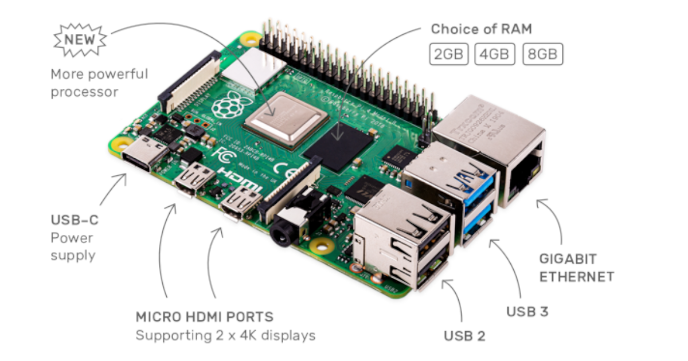
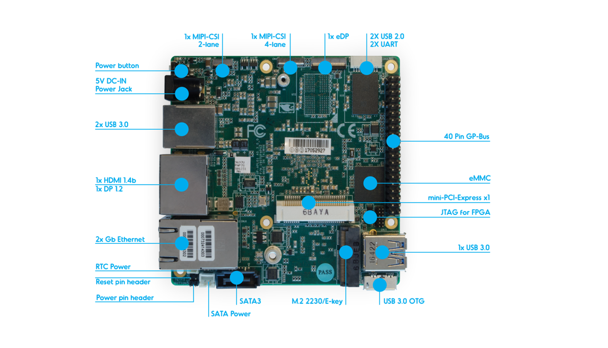

# Asociacion De Investigacion En Inteligencia Artificial Para La Leucemia Peter Moss
## HIAS GeniSysAI Natural Language Understanding

      

&nbsp;

# Table Of Contents

- [Introduction](#introduction)
- [HIAS: Hospital Intelligence Automation System](#hias-hospital-intelligent-automation-system)
- [HIAS GeniSysAI Artificial Intelligence](#hias-genisysai-artificial-intelligence)
    - [Hardware](#hardware)
        - [Raspberry Pi](#raspberry-pi)
        - [UP2 (UP Squared)](#up2-up-squared)
    - [Natural Language Understanding Engines](#natural-language-understanding-engines)
    	- [Types Of Natural Language Understanding Engines](#types-of-natural-language-understanding-engines)
    	- [Natural Language Understanding Engine Projects](#natural-language-understanding-engine-projects)
			- [RPI Natural Language Understanding Engine Projects](#rpi-natural-language-understanding-engine-projects)
- [Contributing](#contributing)
    - [Contributors](#contributors)
- [Versioning](#versioning)
- [License](#license)
- [Bugs/Issues](#bugs-issues)

&nbsp;

# Introduction
Artifical Intelligence (AI) is revolutionizing the world we live in. Through the combination of AI technologies and other modern technologies such as the Internet of Things (IoT), we can now automate many areas of our lives. The same is true for the medical industry.

**HIAS GeniSysAI Natural Language Understanding Engines** provide IoT connected Natural Language Understanding systems for the HIAS (Hospital Intelligence Automation System) network. These systems work together to provide an AI assistant for medical facilities that can communicate and control the devices on the HIAS network.

&nbsp;

# HIAS: Hospital Intelligence Automation System

[HIAS](https://github.com/LeukemiaAiResearch/HIAS) is an open-source **Hospital Intelligent Automation System** designed to control and manage an intelligent network of IoT connected devices. The network server provides locally hosted and encrypted databases, and a secure proxy to route traffic to the connected devices.

The server UI provides the capabilities of managing a network of open-source intelligent devices and applications, these devices/applications and databases all run and communicate on the local network. This means that premises have more control and security when it comes to their hardware, data and storage.

&nbsp;

# HIAS GeniSysAI Artificial Intelligence
[GeniSysAI](https://github.com/GeniSysAI) is an open source intelligent home network assistant using Natural Language Understanding, Computer Vision and a range of IoT connected devices.

The projects provided in this repository are based on the [GeniSysAI NLU (Natural Language Understanding Engine)](https://github.com/GeniSysAI/NLU) projects.

## Hardware
HIAS GeniSysAI devices are designed to be used on popular low powered, IoT devices such as **Raspberry Pi** and **Aaeon's UP2 (Up Squared)**. This makes them easy to use and affordable.

### Raspberry Pi

Raspberry Pi by the **Raspberry Pi Foundation** are the most popular of the available mini ARM computers. RPIs provide easily affordable single board computers that have been widely adopted by the IoT and AI communities. The HIAS GeniSysAI projects suppory Raspberry Pi 3 and 4.

### UP2 (UP Squared)

UP2 by **Aaeon** are also popular with the IoT and AI communities. Unlike the Raspberry Pi, the UP2 have Intel Pentium quad-core processors. The UP2 are bigger than the Raspberry Pi, but are also more expensive.

## Natural Language Understanding Engines
Natural Language Understanding (NLU) is a popular subset of Artificial Intelligence, but also one of the hardest to overcome. Many believe that by the time we have the capabilities of creating machines capable of really understanding human language, and consicously knowing what they are talking about, we will be close to the sentient AI and the singularity.

### Types Of Natural Language Understanding Engines

Today's NLUs do not have any conscious understanding of what they are saying, but that doesn't mean that they cannot be used to create advanced natural language based systems. There are two main types of NLUs, Retrieval Based and Generative.

Retrieval based NLUs are trained to understand intents, the AI is provided a dataset of different ways a person may say something and the responses are hardcoded response, in short the intelligence is being able to identify what a human or machine has said, not generating it's own understandable and relevant responses. Retrieval based NLUs are generally accompanied by Named Entity Recognition (NER) models. NERs are trained to understand keywords within an intent and assist the NLU to understand intents.

Generative NLUs generate their own responses, these systems are typical based on translation AI models. Generative NLU is making a lot of progress, systems such as [GPT-3](https://github.com/openai/gpt-3) by [OpenAI](https://openai.com/) are really pushing the boundaries of Generative Natural Language Understanding, but we are still quite a way off.

### Natural Language Understanding Engine Projects
The HIAS GeniSysAI NLUs currently focus on Retrieval Based NLU. Combined with Speech Recognition & Synthesis, and IoT connectivity we can create an AI that can see, hear, understand and speak. Below you will find details of the Natural Language Understanding Engine projects provided in this repository.

#### RPI Vision Natural Language Understanding Engine Projects

| Project   | Description                                                                                                                                                                                                                                                                                                                                                                                                                                                                                                                                 |
| --- |------------------------------------------------------------------------------------------------------------------------------------------------------------------------------------------------------------------------------------------------------------------------------------------------------------------------------------------------------------------------------------------------------------------------------------------------------------------------------------------------------------------------------------------- |
| [Raspberry Pi 3 TF1.14.0 NLU](NLU/RPI/RPI3/TF1.14.0 "Raspberry Pi 3 TF1.14.0 NLU")   | The Raspberry Pi 3 NLU hosts API endpoints exposing the Natural Language Understanding Engine for remote intent classification requests built using Tensorflow 1.14.0.  |

&nbsp;

# Contributing

Asociacion De Investigacion En Inteligencia Artificial Para La Leucemia Peter Moss encourages and welcomes code contributions, bug fixes and enhancements from the Github community.

Please read the [CONTRIBUTING](CONTRIBUTING.md "CONTRIBUTING") document for a full guide to forking our repositories and submitting your pull requests. You will also find information about our code of conduct on this page.

## Contributors

- [Adam Milton-Barker](https://www.leukemiaresearchassociation.ai/team/adam-milton-barker "Adam Milton-Barker") - [Asociacion De Investigacion En Inteligencia Artificial Para La Leucemia Peter Moss](https://www.leukemiaresearchassociation.ai "Asociacion De Investigacion En Inteligencia Artificial Para La Leucemia Peter Moss") President & Lead Developer, Sabadell, Spain

&nbsp;

# Versioning

We use SemVer for versioning. For the versions available, see [Releases](releases "Releases").

&nbsp;

# License

This project is licensed under the **MIT License** - see the [LICENSE](LICENSE "LICENSE") file for details.

&nbsp;

# Bugs/Issues

We use the [repo issues](issues "repo issues") to track bugs and general requests related to using this project. See [CONTRIBUTING](CONTRIBUTING.md "CONTRIBUTING") for more info on how to submit bugs, feature requests and proposals.