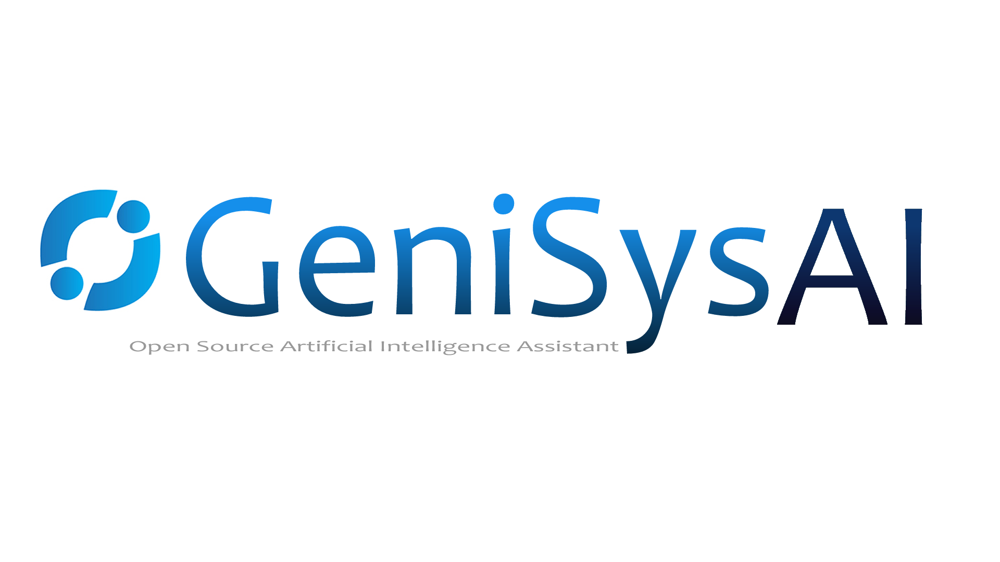
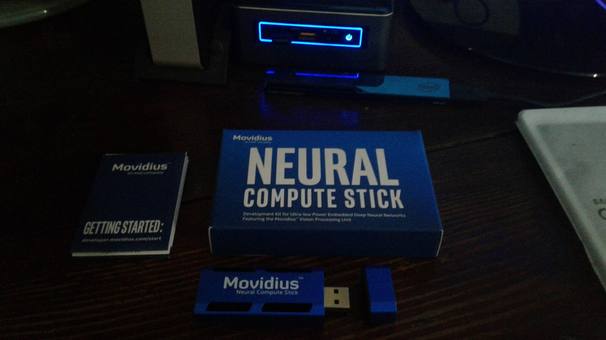
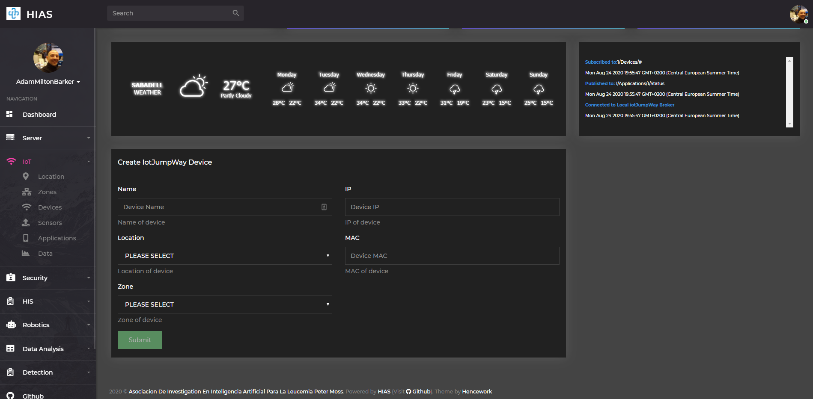

# Peter Moss Leukemia AI Research
## GeniSysAI
### UP2 NCS1 Facial API Security System

[](https://github.com/LeukemiaAiResearch/GeniSysAI)

&nbsp;

# Table Of Contents

- [Introduction](#introduction)
- [Siamese Neural Networks](#siamese-neural-networks)
- [Triplet Loss](#triplet-loss)
- [Intel® Movidius™ Neural Compute Stick](#intel-movidius-neural-compute-stick)
- [Prerequisites](#prerequisites)
  - [HIAS Server](#hias-server)
- [System Requirements](#system-requirements)
- [Hardware Requirements](#hardware-requirements)
- [Server Setup](#server-setup)
  - [UFW Firewall](#ufw-firewall)
  - [Clone the repository](#clone-the-repository)
      - [Developer Forks](#developer-forks)
  - [Install Dependencies](#install-dependencies)
  - [Known & Test Datasets](#known--test-datasets)
  - [Configuration](#configuration)
    - [iotJumpWay](#iotJumpWay)
  - [Server Test](#server-test)
  - [Service Setup](#service-setup)
- [Contributing](#contributing)
    - [Contributors](#contributors)
- [Versioning](#versioning)
- [License](#license)
- [Bugs/Issues](#bugs-issues)

&nbsp;

# Introduction
The UP2 NCS1 Facial API Security System hosts API endpoints exposing a **Facenet** classifier. Facenet uses **Siamese Neural Networks** trained with **Triplet Loss**, and is used in this project due to it's ability to help overcome the **Open Set Recognition Issue** in **facial recogniton**.

The project runs on an **UP Squared** IoT development board and uses an **Intel® Movidius™ Neural Compute Stick 1**.

&nbsp;

# Siamese Neural Networks


Siamese Neural Networks are made up of 2 **Convolutional Neural Networks** that are exactly identical, hence the name Siamese Neural Networks. Siamese Neural Networks can be used to differentiate between objects, or in this case, faces. Facenet uses Siamese Neural Networks that have been trained with Triplet Loss.

Given an unseen example and a known example / multiple known examples we can pass the unseen example through the first Siamese Neural Network, and then compare the output encodings with output encodings from the single or multiple examples by calculating the difference between them. Using this method we are able to determine if the example passed to the first network is the same as one of the known examples, verifying if the person is known or not.

&nbsp;

# Triplet Loss
Triplet Loss was used when training Facenet and reduces the difference between an anchor (an image) and a positive sample from the same class, and increases the difference between the ancher and a negative sample from an opposite class. Basically this means that 2 images with the same class (in this case, the same person) will have a smaller distance than two images from different classes (or 2 different people).

&nbsp;

# Intel® Movidius™ Neural Compute Stick

The Intel® Movidius™ Neural Compute Stick is a piece of hardware, specifically a USB device, used for enhancing the inference process of computer vision models on low-powered/edge devices. The Intel® Movidius™ product is a USB appliance that can be plugged into devices such as Raspberry Pi and UP Squared, and basically takes the processing power off the device and onto the Intel Movidius brand chip, making the classification process a lot faster.

&nbsp;

# Prerequisites
Before you can install this project there are some prerequisites.

## HIAS Server
If you are going to be using the full system you will need to install the [HIAS](https://github.com/LeukemiaAiResearch/HIAS) server. Follow the [HIAS Installation Guide](https://github.com/LeukemiaAiResearch/HIAS/blob/master/Documentation/Installation/Installation.md) to complete your HIAS server setup.

&nbsp;

# System Requirements
- Tested on Ubuntu 18.04 & 16.04
- [Python 3.6](https://www.python.org/ "Python 3.6")
- Requires PIP3
- [Intel® Movidius™ NCSDK](https://github.com/movidius/ncsdk "Intel® Movidius™ NCSDK")
- [Tensorflow 1.4.0](https://www.tensorflow.org/install "Tensorflow 1.4.0")

# Hardware Requirements
- 1 x [Intel® Movidius™ Neural Compute Stick](https://www.movidius.com/ "Intel® Movidius™ Neural Compute Stick")
- 1 x UP Squared

&nbsp;

# Server Setup
Now we will setup the UP2 NCS1 Facial API Security System. The following tutorial will take you through the setup steps.

## UFW Firewall
UFW firewall is used to protect the ports of your TASS device. Use the following command to check the status of your firewall:

```
  sudo ufw status
```
You should see the output:
```
  Status: inactive
```

The ports are specified in **Required/config.json**. The default setting is set to **8080** for the streaming port.

**FOR YOUR SECURITY YOU SHOULD CHANGE THIS!**.

```
  "Server": {
      "IP": "",
      "Port": 8080
  }
```

To allow access to the ports use the following command for each of your ports:

```
  sudo ufw allow 22
  sudo ufw allow 8080
  audo ufw enable
  sudo ufw status
```

You should see the following output:

```
  Status: active

  To                         Action      From
  --                         ------      ----
  22                         ALLOW       Anywhere
  8080                       ALLOW       Anywhere
  22 (v6)                    ALLOW       Anywhere (v6)
  8080 (v6)                  ALLOW       Anywhere (v6)
```

## Clone the repository
Clone the [HIAS GeniSysAI](https://github.com/LeukemiaAiResearch/GeniSysAI "HIAS GeniSysAI") repository from the [Asociacion De Investigacion En Inteligencia Artificial Para La Leucemia Peter Moss](https://github.com/LeukemiaAiResearch "Asociacion De Investigacion En Inteligencia Artificial Para La Leucemia Peter Moss") Github Organization.

To clone the repository and install the ALL Detection System 2019, make sure you have Git installed. Now navigate to the home directory on your device using terminal/commandline, and then use the following command.

```
  git clone https://github.com/LeukemiaAiResearch/GeniSysAI.git
```

Once you have used the command above you will see a directory called **GeniSysAI** in your home directory.

```
ls
```

Using the ls command in your home directory should show you the following.

```
GeniSysAI
```

Navigate to **GeniSysAI/Vision/UP2/NCS1/API** directory, this is your project root directory for this tutorial.

### Developer Forks
Developers from the Github community that would like to contribute to the development of this project should first create a fork, and clone that repository. For detailed information please view the [CONTRIBUTING](../../../CONTRIBUTING.md "CONTRIBUTING") guide. You should pull the latest code from the development branch.

```
  git clone -b "0.2.0" https://github.com/LeukemiaAiResearch/GeniSysAI.git
```

The **-b "0.2.0"** parameter ensures you get the code from the latest master branch. Before using the below command please check our latest master branch in the button at the top of the project README.

## Install Dependencies
Now you will install the required dependencies. [Setup.sh](Setup.sh "Setup.sh")is an executable shell script that will do the following:

- Install the required Python packages
- Install full NCSDK
- Downloads the pretrained Facenet model (**davidsandberg/facenet**)
- Downloads the pretrained **Inception V3** model
- Converts the **Facenet** model to a **Intel® Movidius/NCSDK** compatible graph

To execute the script, make enter the following commands. This will take a long time!

```
  sed -i 's/\r//' Setup.sh
  sh Setup.sh
```

## Known & Test Datasets
Before you can use your facial identification server, you need to add 1 image of all people that you want your server to classify as known to the **Model/Data/Known** directory and as many different faces as you like to the **Model/Data/Test** directory. The provided [client](Client.py "client") can be used to loop through this directory and send them to the inference endpoint for classification.

## Configuration
You need to updated the following settings in [Required/confs.json](Required/confs.json "Required/confs.json") to ensure that your server is accessible.

- The value **Server->IP** should be the IP of your server machine.
- The value **Server->Port** should be the port that the server is listening on.

```
  "Server": {
      "IP": "",
      "Port": 8080
  }
```

### iotJumpWay


You need to setup your iotJumpWay device that will be used to communicate with the HIAS iotJumpWay broker. In the HIAS UI, navigate to **IoT->Devices** and then click on the **+** button to create a new device.

Once you have created your device you will be taken to the new device page. Add your server name and the information provided on that page to your server configuration.

```
  "iotJumpWay": {
      "host": "",
      "port": 8883,
      "ip": "localhost",
      "lid": 1,
      "zid": 1,
      "did": 9,
      "dn": "",
      "un": "",
      "pw": ""
  }
```

## Server Test
To make sure that your server is responding correctly, you can use [Client.py](Client.py "Client.py") in **Test** mode which will loop through all the images in your **Model/Data/Test** and compare them with your known dataset in **Data/Known**.

Execute the following command to start your server:

```
 python3 Server.py
```

You should see the following output:

```
2020-08-24 19:25:42,157 - Server - INFO - Helpers class initialization complete.
2020-08-24 19:25:42,159 - iotJumpWay - INFO - Helpers class initialization complete.
2020-08-24 19:25:42,159 - iotJumpWay - INFO - Initiating Local iotJumpWay Device.
2020-08-24 19:25:42,160 - iotJumpWay - INFO - JumpWayMQTT Device Initiated.
2020-08-24 19:25:42,160 - iotJumpWay - INFO - Initiating Local iotJumpWay Device Connection.
2020-08-24 19:25:42,347 - iotJumpWay - INFO - Local iotJumpWay Device Connection Initiated.
2020-08-24 19:25:42,349 - iotJumpWay - INFO - -- Subscribed to Device Commands Channel
2020-08-24 19:25:42,352 - NCS1 - INFO - Helpers class initialization complete.
2020-08-24 19:25:42,353 - iotJumpWay - INFO - Local iotJumpWay Device Connection Successful.
2020-08-24 19:25:42,354 - iotJumpWay - INFO - rc: 0
2020-08-24 19:25:42,355 - iotJumpWay - INFO - Published to Device Status 1/Devices/1/9/Status
2020-08-24 19:25:42,356 - iotJumpWay - INFO - -- Published to Device channel
2020-08-24 19:25:42,359 - iotJumpWay - INFO - JumpWayMQTT Subscription: 1
2020-08-24 19:25:43,249 - NCS1 - INFO - Connected to Neural Compute Stick 1
2020-08-24 19:25:43,287 - NCS1 - INFO - Loaded NCS1 graph
2020-08-24 19:25:43,917 - NCS1 - INFO - Known data preprocessed!
2020-08-24 19:25:46,695 - NCS1 - INFO - NCS1 class initialized.
2020-08-24 19:25:46,696 - Server - INFO - NCS configured.
 * Serving Flask app "Server" (lazy loading)
 * Environment: production
   WARNING: This is a development server. Do not use it in a production deployment.
   Use a production WSGI server instead.
 * Debug mode: off
 * Running on http://###.###.#.##:8080/ (Press CTRL+C to quit)
```

Next open a new terminal and execute the following command:

```
 python3 Client.py Test
```

The output from my test dataset in the Client terminal:

```
2020-08-24 19:37:37,027 - Client - INFO - Helpers class initialization complete.
2020-08-24 19:37:37,028 - Client - INFO - NCS1 class initialized.
2020-08-24 19:37:37,051 - Client - INFO - Sending Model/Data/Test/1.jpg
2020-08-24 19:37:42,677 - Client - INFO - Sending Model/Data/Test/2.jpg
2020-08-24 19:37:48,287 - Client - INFO - Sending Model/Data/Test/3.jpg
```

The output from my test dataset in the Server terminal:

```
2020-08-24 19:37:37,532 - NCS1 - INFO - Calculated Match: 0.0
2020-08-24 19:37:37,533 - NCS1 - INFO - GeniSysAI identified User #1
2020-08-24 19:37:37,667 - Server - INFO - GeniSys detected 1 known humans and 0 intruders.
2020-08-24 19:37:37,669 - iotJumpWay - INFO - -- Published to Device channel
192.168.1.26 - - [24/Aug/2020 19:37:37] "POST /Inference HTTP/1.1" 200 -
2020-08-24 19:37:43,128 - NCS1 - INFO - Calculated Mismatch: 2.003763258457184
2020-08-24 19:37:43,273 - NCS1 - INFO - Calculated Match: 0.0
2020-08-24 19:37:43,273 - NCS1 - INFO - GeniSysAI identified User #2
2020-08-24 19:37:43,276 - Server - INFO - GeniSys detected 1 known humans and 0 intruders.
2020-08-24 19:37:43,279 - iotJumpWay - INFO - -- Published to Device channel
192.168.1.26 - - [24/Aug/2020 19:37:43] "POST /Inference HTTP/1.1" 200 -
2020-08-24 19:37:48,736 - NCS1 - INFO - Calculated Mismatch: 1.707361876964569
2020-08-24 19:37:48,880 - NCS1 - INFO - Calculated Mismatch: 1.7294368147850037
2020-08-24 19:37:49,025 - NCS1 - INFO - Calculated Match: 0.0
2020-08-24 19:37:49,025 - NCS1 - INFO - GeniSysAI identified User #3
2020-08-24 19:37:49,027 - Server - INFO - GeniSys detected 1 known humans and 0 intruders.
2020-08-24 19:37:49,026 - iotJumpWay - INFO - -- Published to Device channel
```

## Service Setup
To ensure that the API will start each time your UP2 boots up, we will create a service. Use the following command to create and open a new service file.

```
  sudo nano /lib/systemd/system/api.service
```

Next add the following code to the file, replacing **YourUser** with the username you use to login to your UP2 with.

```
[Unit]
Description=GeniSysAI Facial API Security System
After=multi-user.target

[Service]
User=YourUser
Type=simple
ExecStart=/usr/bin/python3 /home/YourUser/GeniSysAI/Vision/UP2/NCS1/API/Server.py

[Install]
WantedBy=multi-user.target
```

Save and close the file, and then use the following command to restart the services daemon.

```
  sudo systemctl daemon-reload
```

Now enable, start and check your service.

```
sudo systemctl enable api.service
sudo systemctl start api.service
sudo systemctl status api.service
```

You should see the following output.

```
● api.service - GeniSysAI Facial API Security System
   Loaded: loaded (/lib/systemd/system/api.service; enabled; vendor preset: enabled)
   Active: active (running) since Mon 2020-08-24 19:45:31 CEST; 4s ago
 Main PID: 3481 (python3)
    Tasks: 4
   Memory: 46.3M
      CPU: 2.878s
   CGroup: /system.slice/api.service
           └─3481 /usr/bin/python3 /home/YourUser/GeniSysAI/Vision/UP2/NCS1/API/Server.py
```

Your API server will now start every time you boot up your UP2. You can use the following commands to manage your service in the future.

```
sudo systemctl restart api.service
sudo systemctl start api.service
sudo systemctl stop api.service
sudo systemctl status api.service
```

&nbsp;

# Contributing
Asociacion De Investigacion En Inteligencia Artificial Para La Leucemia Peter Moss encourages and welcomes code contributions, bug fixes and enhancements from the Github community.

Please read the [CONTRIBUTING](../../../CONTRIBUTING.md "CONTRIBUTING") document for a full guide to forking our repositories and submitting your pull requests. You will also find information about our code of conduct on this page.

## Contributors

- [Adam Milton-Barker](https://www.leukemiaresearchassociation.ai/team/adam-milton-barker "Adam Milton-Barker") - [Asociacion De Investigation En Inteligencia Artificial Para La Leucemia Peter Moss](https://www.leukemiaresearchassociation.ai "Asociacion De Investigation En Inteligencia Artificial Para La Leucemia Peter Moss") President & Lead Developer, Sabadell, Spain

&nbsp;

# Versioning

We use SemVer for versioning. For the versions available, see [Releases](../../../releases "Releases").

&nbsp;

# License

This project is licensed under the **MIT License** - see the [LICENSE](../../../LICENSE "LICENSE") file for details.

&nbsp;

# Bugs/Issues

We use the [repo issues](../../../issues "repo issues") to track bugs and general requests related to using this project.